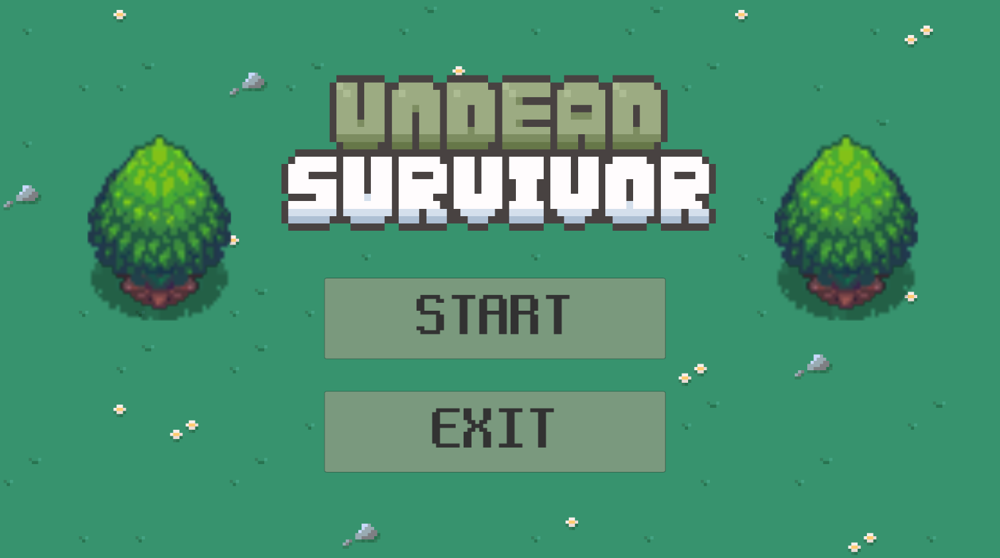
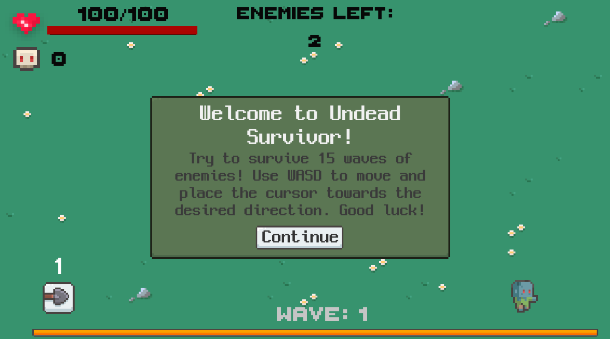
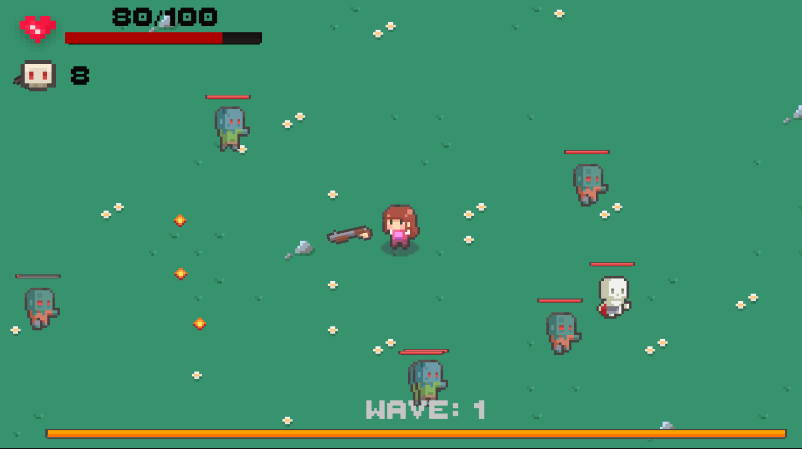
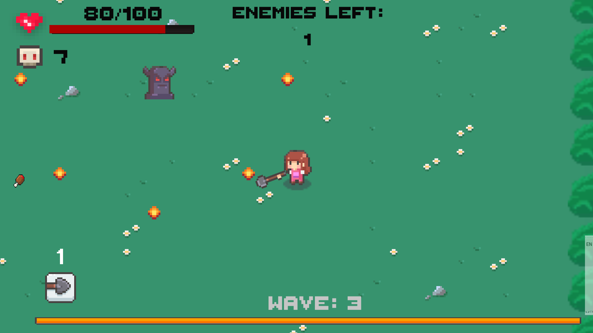
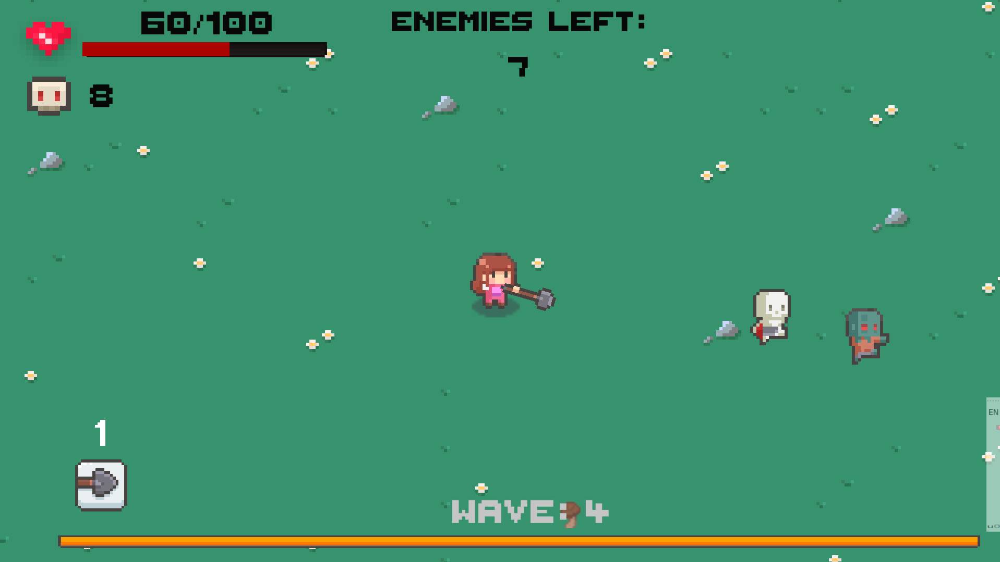
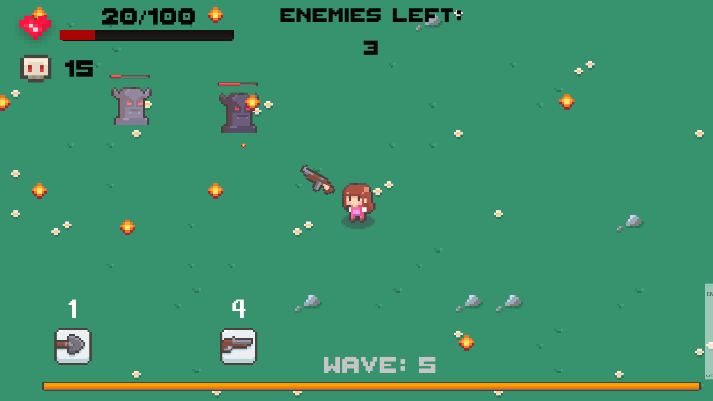

# Undead Survival

Undead Survival is a Unity game project about a girl surviving an apocalypse. To win the game, the player must complete 15 waves with a boss at the end (it is way harder than you might think).

## Demo

Check out a demo of the game on YouTube: [Undead Survival Demo](https://youtu.be/kN8O_ynW8W4)

## Screenshots



<details>
<summary>More screenshots</summary><br>







</details>

## Game Features

- **Weapons**: 4 types of weapons for different combat mechanics. 2 melee weapons, a shovel and a rake, and 2 firearms, a rifle and an assault rifle. Weapons are unlocked randomly as you progress through certain waves (4, 8, 12). Switch weapons using the corresponding numbers on the keyboard.
- **Health Bars**: Health bars for both the player and enemies.
- **Player Orientation**: The player faces the mouse direction (left or right), and firearms aim towards the mouse direction (rotate around the player). Automatic shooting/attacking.
- **Waves**: Each wave has a certain number of enemies. The current wave and remaining number of enemies are displayed on the screen.
- **Health Restoration**: Restore missing health with food that has a certain chance to drop from enemies (meat, chicken legs, pizza, noodles).
- **Enemies**: 5 types of enemies and a final boss! They have different movement speeds, deal different amounts of damage, have varying health values, and some can shoot.

## Installation and Setup

1. Download and install [Unity](https://unity.com/).
2. Clone the repository:
    ```bash
    git clone https://github.com/your-username/UndeadSurvival.git
    ```
3. Open the project in Unity.
4. Build and run the game.

The game can also be downloaded from the following link: [Undead Survival on itch.io](https://karadespot.itch.io/undead-survival).


## Controls

- **Switch Weapon**: Press the number shown above the weapon.
- **Movement**: Use WASD for movement.
- **Aim**: Aim the weapon in the desired direction to attack.
- **Pause**: Press P or ESC to pause the game.


## License

This project is licensed under the Creative Commons Attribution-NonCommercial 4.0 International (CC BY-NC 4.0) License.

You are free to:
- Share: copy and redistribute the material in any medium or format
- Adapt: remix, transform, and build upon the material

Under the following terms:
- Attribution: You must give appropriate credit, provide a link to the license, and indicate if changes were made. You may do so in any reasonable manner, but not in any way that suggests the licensor endorses you or your use.
- NonCommercial: You may not use the material for commercial purposes.

For more details, see the [license text](https://creativecommons.org/licenses/by-nc/4.0/legalcode).

© 2024 [KaraDespot]

## Authors

- [KaraDespot](https://github.com/KaraDespot)

## Contributing

If you want to contribute to the project, please fork the repository and submit a pull request. I welcome any suggestions and improvements!

## Contact

If you have any questions or suggestions, please reach out to me through [GitHub Issues](https://github.com/KaraDespot/UndeadSurvival/issues).